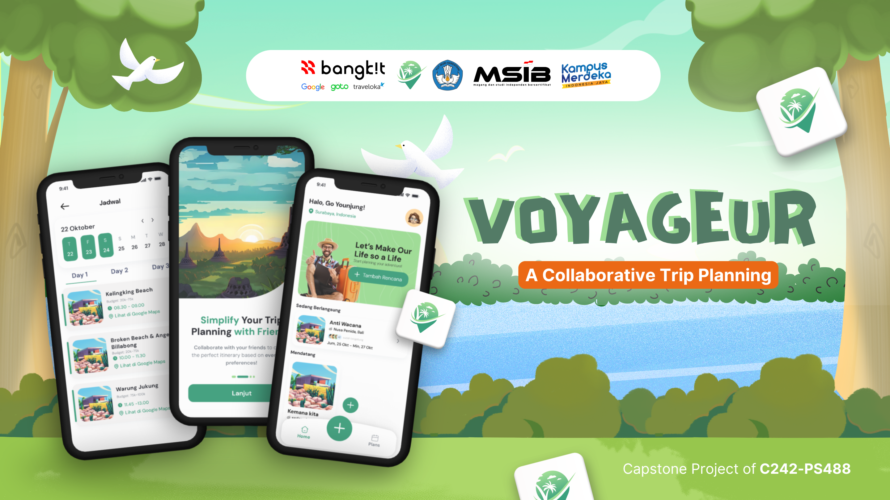
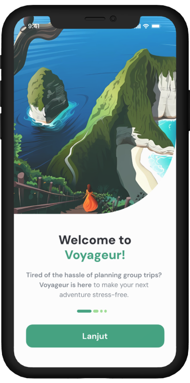
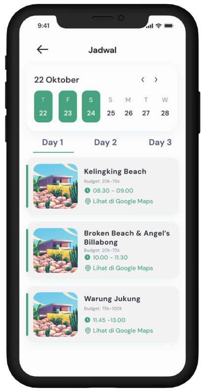
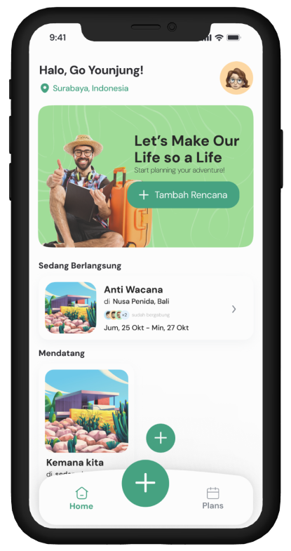

 

  

 

# Voyageur - A Collaborative Trip Planning App
Voyageur is a collaborative trip planning application designed to simplify group travel. The app helps users coordinate destinations, schedules, and budgets effortlessly while ensuring every group member's preferences are considered using a vote-based system. With features like destination recommendations, itinerary customization, real-time collaboration, and budget management tools, Voyageur transforms the complexities of group trip planning into a smooth and enjoyable experience. Whether you're planning a family vacation, a getaway with friends, or a corporate retreat, Voyageur makes organizing group trips as fun as the journey itself.

   &nbsp; &nbsp; &nbsp;
   &nbsp; &nbsp; &nbsp;
  

# Our Team

### Team ID: **C242 - PS488**

We are a diverse and skilled team of professionals collaborating to create innovative solutions. With expertise spanning **Machine Learning**, **Cloud Computing**, and **Mobile Development**, our mission is to deliver a product that enhances group travel planning with cutting-edge technology.

| **No** | **Learning Path**    | **ID Peserta**    | **Nama**                | **Status**  | **Contact** |
|--------|---------------------|-------------------|-------------------------|-------------|-------------|
| 1      | Machine Learning     | M296B4KX3620      | Rahayu Kartika Sari     | Active      | [LinkedIn](https://www.linkedin.com/in/rahayu-kartika-sari-89b657256/) |
| 2      | Machine Learning     | M296B4KX2069      | Jihan Hasna Iftinan     | Active      | [LinkedIn](https://www.linkedin.com/in/jihan-hasna-iftinan-a56260240/) |
| 3      | Machine Learning     | M296B4KX3450      | Nurul Izzah             | Active      | [LinkedIn](https://www.linkedin.com/in/nurul-izzah-377979206/) |
| 4      | Cloud Computing      | C296B4KY0961      | Daffa Ahmad Baihaqi     | Active      | [LinkedIn](https://www.linkedin.com/in/daffaahmadb/) |
| 5      | Cloud Computing      | C296B4KY2992      | Muhammad Rafi Irsyadhie | Active      | [LinkedIn](https://www.linkedin.com/in/muhammadrafiirsyadhie/) |
| 6      | Mobile Development   | A296B4KY1114      | Dias Norman             | Active      | [LinkedIn](https://www.linkedin.com/in/diasnormann/) |

---

## Product Modules

### 1. Mobile Application
Focuses on providing an intuitive user interface and smooth user experience for group travel planning on the go.

- Repository: [Mobile Development](https://github.com/Voyageur-Team/MobileDevelopment)

### 2. Machine Learning
Implements AI-powered recommendations for destinations and budget management based on user preferences.

- Repository: [Machine Learning](https://github.com/Voyageur-Team/Machine-Learning)

### 3. Cloud Computing
Ensures secure and scalable backend services for real-time collaboration and data storage.

- Repository: [Cloud Computing](https://github.com/Voyageur-Team/CloudComputing)

---

  <strong>Discover Together, Explore With Voyageur</strong>

